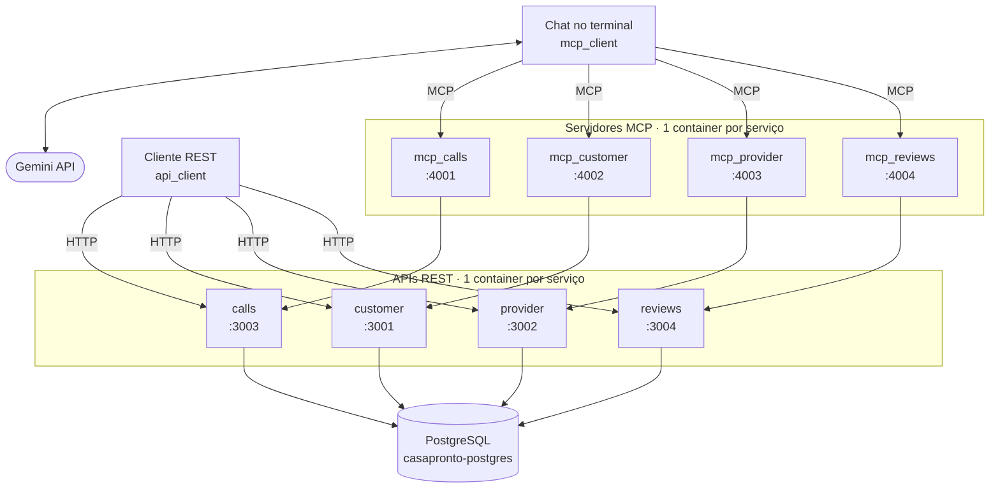

# CasaPronto

Plataforma de contratação de serviços residenciais (eletricista, encanador, jardineiro, faxineira e pintor), construída como **microsserviços REST em containers Docker** e exposta a uma IA (Gemini) pelo protocolo **MCP**.

Trabalho da disciplina *Desenvolvimento de Aplicações Orientadas a Serviços* (IFBA, Vitória da Conquista).

## Arquitetura

```
   ┌──────────────────────┐          ┌───────────────────────────────┐
   │ Cliente REST         │          │ Chat no terminal              │
   │ (api_client)         │          │ (mcp_client)  ◄──►  Gemini    │
   └──────────┬───────────┘          └───────────────┬───────────────┘
              │                                      │ MCP · HTTP
              │                                      ▼
              │       ┌─────────────────────────────────────────────────┐
              │       │ Servidores MCP  ─ 1 container por serviço       │
              │       │ calls :4001 · customer :4002 ·                  │
              │       │ provider :4003 · reviews :4004                  │
              │       └──────────────────────────────┬──────────────────┘
              │ HTTP / REST                          │ HTTP / REST
              ▼                                      ▼
   ┌────────────────────────────────────────────────────────────────────┐
   │ APIs REST  ─ 1 container por serviço                               │
   │ calls :3003 · customer :3001 · provider :3002 · reviews :3004      │
   └─────────────────────────────────────────────────┬──────────────────┘
                                                     │ SQL
                                                     ▼
                                          ┌─────────────────────┐
                                          │ PostgreSQL          │
                                          │ casapronto-postgres │
                                          └─────────────────────┘
```

Mesmo diagrama em Mermaid (renderizado automaticamente no GitHub):



## Serviços

Cada serviço tem uma única responsabilidade e roda no seu próprio container. Cada servidor MCP expõe ferramentas que consultam **a API do serviço correspondente**.

| Serviço | API (porta) | Endpoints `GET` | MCP (porta) | Ferramentas MCP |
|---|---|---|---|---|
| **customer** | 3001 | `/customer`<br>`/customer/search?name=`<br>`/customer/:id/calls` | 4002 | `get_customers`<br>`search_customers_by_name`<br>`get_customer_calls` |
| **provider** | 3002 | `/provider`<br>`/provider/search?specialty=`<br>`/provider/ranking?specialty=&limit=` | 4003 | `get_providers`<br>`get_provider_by_specialty`<br>`get_provider_ranking` |
| **calls** | 3003 | `/calls`<br>`/calls/summary`<br>`/calls/:id` | 4001 | `get_calls`<br>`get_calls_summary`<br>`get_call_by_id` |
| **reviews** | 3004 | `/reviews`<br>`/reviews/summary`<br>`/reviews/provider/:id` | 4004 | `get_reviews`<br>`get_reviews_summary`<br>`get_reviews_by_provider` |

Todas as APIs também expõem `GET /health`.

## Estrutura de pastas

```
src/
├── services/     # PostgreSQL + 4 APIs REST (docker-compose.yml e script SQL)
├── mcp_server/   # 4 servidores MCP (1 imagem, 4 containers) + docker-compose.yml
├── api_client/   # cliente de terminal que consome as APIs REST
└── mcp_client/   # chat no terminal: Gemini + ferramentas MCP
```

## Pré-requisitos

- Docker e Docker Compose
- Node.js 20 ou superior
- Chave da API do Google AI (Gemini): <https://aistudio.google.com/apikey>

## Como executar

Todos os comandos partem da pasta `src/`. Use um terminal para cada etapa.

### 1. Banco de dados e APIs REST

```bash
cd services
docker compose up -d --build
```

O PostgreSQL é criado e povoado pelo script `casapronto.sql` (tabelas `providers`, `customers`, `calls` e `reviews`). Este compose também cria a rede Docker `casapronto`, usada pelos servidores MCP, e por isso **precisa subir antes do passo 2**.

Aguarde cerca de 10 segundos (o banco está sendo criado e povoado) e confirme que as quatro APIs responderam:

```bash
curl localhost:3001/health   # customer
curl localhost:3002/health   # provider
curl localhost:3003/health   # calls
curl localhost:3004/health   # reviews
```

### 2. Servidores MCP

```bash
cd mcp_server
docker compose up -d --build
docker compose ps            # 4 containers: mcp_calls, mcp_customer, mcp_provider, mcp_reviews
```

Os servidores MCP entram na rede `casapronto` e acessam as APIs pelo nome dos containers (ex.: `http://casapronto-calls:3000/calls`), sem depender de portas do host.

### 3. Cliente das APIs REST

```bash
cd api_client
npm install
npm start
```

Menu interativo com as 12 consultas (3 por serviço). A opção `s` mostra o status dos quatro serviços.

### 4. Chat com IA (MCP)

```bash
cd mcp_client
npm install
cp .env.example .env         # Windows (PowerShell): copy .env.example .env
# edite o .env e informe a GOOGLE_API_KEY
npm run build
node build/index.js
```

O chat conecta nos quatro servidores MCP, lista as ferramentas de cada um e passa a responder perguntas em linguagem natural. Digite `quit` para sair.

> Os quatro servidores MCP precisam estar no ar **ao iniciar** o chat.

## Testando a resiliência do cliente REST

Com o cliente aberto, derrube um serviço em outro terminal:

```bash
docker ps                          # veja o nome do container do provider
docker stop <container-do-provider>
```

- A opção `s` mostra o provider como **OFFLINE**.
- Consultas aos outros serviços continuam funcionando.
- Consultas ao provider mostram "serviço indisponível", sem encerrar o cliente.

Suba o container novamente e o consumo é retomado sem reiniciar o cliente:

```bash
docker start <container-do-provider>
```

## Exemplos de perguntas para o chat

| Pergunta | Ferramentas usadas |
|---|---|
| Quantos chamados estão pendentes e quantos foram concluídos? | `get_calls_summary` |
| Quem é o prestador mais bem avaliado? | `get_provider_ranking` |
| Quais chamados a Fernanda Lima abriu? | `search_customers_by_name` → `get_customer_calls` |
| O que os clientes dizem da Maria Souza? | `get_provider_by_specialty` → `get_reviews_by_provider` |
| Qual a nota média geral das avaliações? | `get_reviews_summary` |

Nas perguntas com duas ferramentas, a IA encadeia serviços diferentes: a primeira ferramenta descobre um `id`, e a segunda usa esse `id`.

## Como parar tudo

```bash
cd mcp_server && docker compose down
cd ../services && docker compose down
```

## Decisões de projeto

- **Um serviço, uma responsabilidade, um container**, tanto nas APIs quanto nos servidores MCP.
- **Agregações no banco:** contagens, médias e rankings são calculados em SQL pelas APIs. A IA recebe o resultado pronto, em vez de calcular sobre listagens.
- **MCP sem estado:** transporte Streamable HTTP em modo *stateless* (um servidor MCP por requisição), sem sessões em memória.
- **Imagem única para os MCPs:** a variável de ambiente `SERVICE` define qual serviço cada container expõe.
- **Consultas parametrizadas** (`$1`, `$2`) e validação de entrada em todas as rotas com parâmetros.

## Problemas comuns

| Sintoma | Causa provável e correção |
|---|---|
| O chat não inicia | Algum container MCP está fora do ar. Rode `docker compose ps` em `mcp_server`. |
| A IA responde "Falha ao buscar..." | A API correspondente está parada, ou a variável `*_API_BASE` do MCP aponta para a porta errada. Veja `docker compose logs mcp_<serviço>`. |
| `ECONNREFUSED` nos logs do MCP | Dentro do container `localhost` é o próprio container. As URLs `*_API_BASE` devem usar o nome do container e a porta interna (`http://casapronto-calls:3000/...`). |
| `network casapronto declared as external, but could not be found` | O compose de `services` não foi iniciado. Ele cria a rede e deve subir antes do `mcp_server`. |
| Erro de porta em uso | Outro processo usa a porta. Confira com `docker ps` e ajuste o `ports` do compose. |
